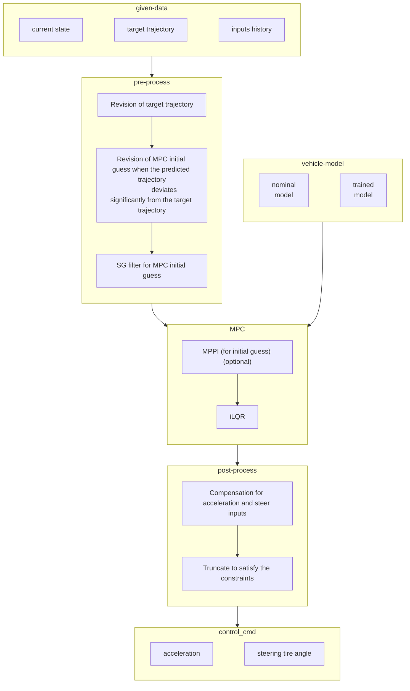
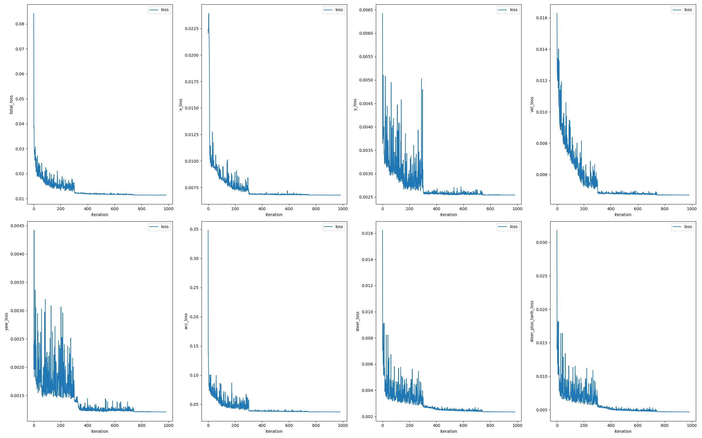
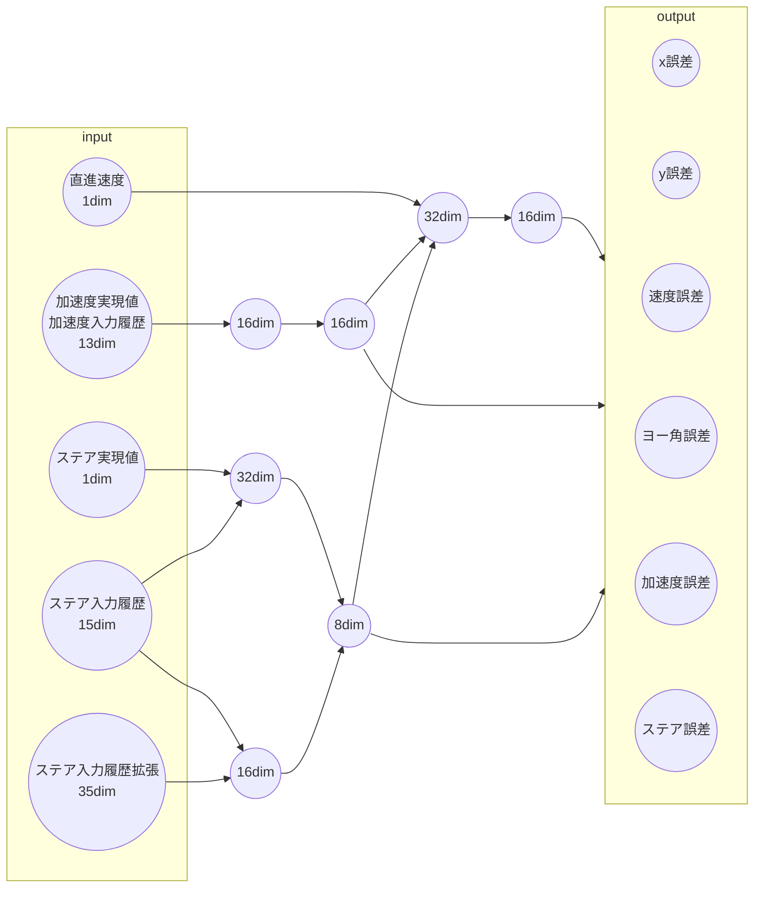
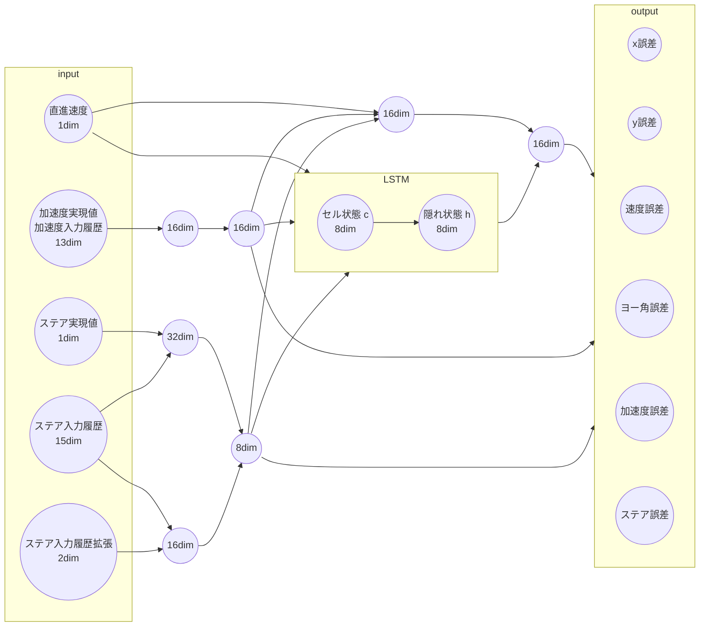
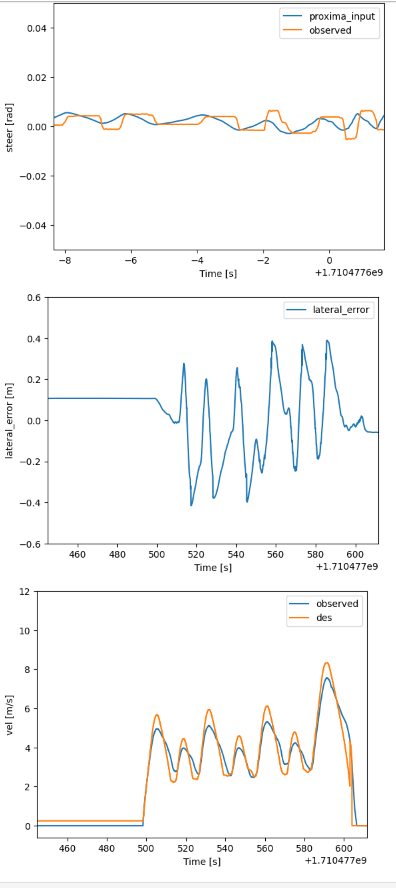
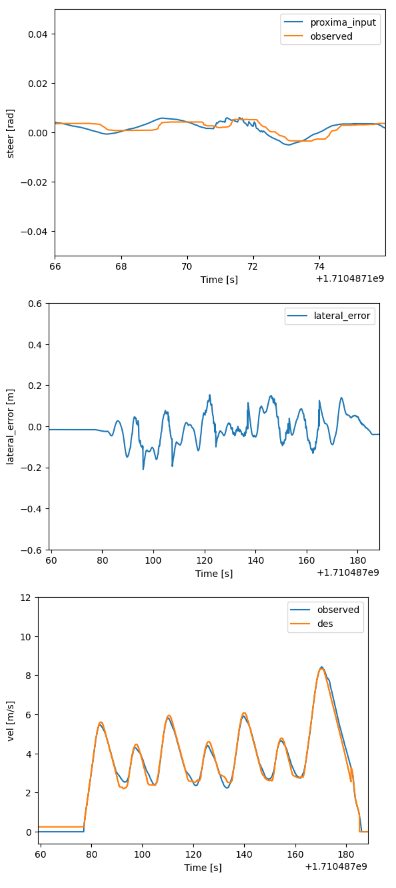
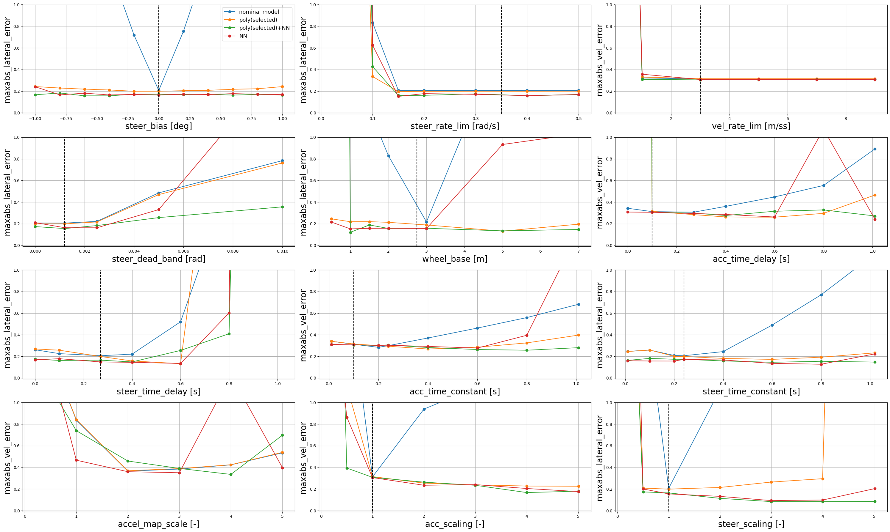
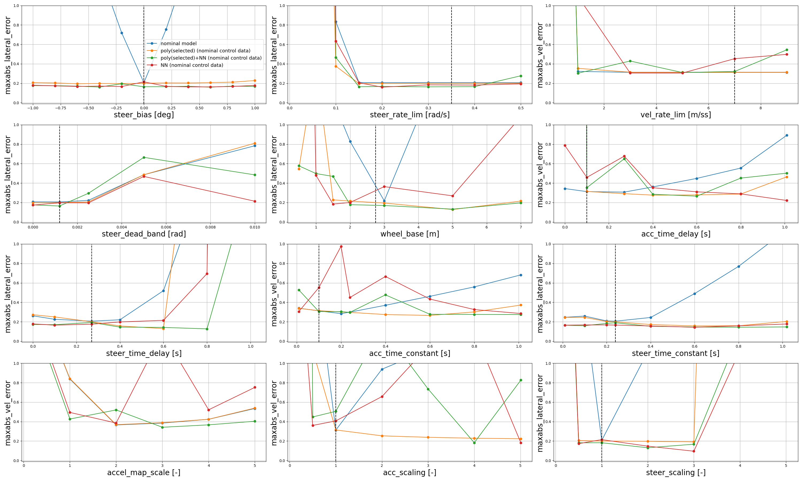

<!-- cspell: ignore numba LSTM -->

# Proxima Controller in Autoware

<!--
注意： このドキュメントで書くべきこと

アルゴリズムは把握しているので、現時点では説明不要です。まずはどういう理由で何をしているのか、どのようなプロセス、設計なのか、どのようなパラメータを意識しているのかが把握できればokです。ここでこんな処理してたのか、みたいな見落としをなくしたいと思っています.）
-->

## 背景

様々な車両において、パラメータの細かいキャリブレーションなしで動くようなadaptiveな制御がしたい。
モデルパラメータがずれていても学習によって十分な性能が得られるようにしたい。
非線形MPCを線形化に基づいて高速に計算するiLQRおよび、
サンプリングベースの手法であり、ダイナミクスの微分は用いないMPPIを検証。
MPPIはステア不感帯に対応することを期待するが、計算資源の問題もあり、MPPIを使う場合は
MPPIによりiLQRの初期値を用意するという方法のみを想定する形となっている。
ただし、制御モードとしてはMPPIのみを用いる場合も実装している。

## セットアップ

autowareのビルドが終了後、`control/autoware_smart_mpc_trajectory_follower`に移動して、次のコマンドで`autoware_smart_mpc_trajectory_follower`のpythonパッケージをインストールする。

```bash
pip3 install .
```

パッケージに変更を加えて再びインストールする際は次のようにする。

```bash
pip3 install -U .
```

## シミュレーション手順

シミュレーション走行を行うには次のコマンドを実行する。

```bash
ros2 launch autoware_launch planning_simulator.launch.xml map_path:=$HOME/autoware_map/sample-map-planning vehicle_model:=sample_vehicle sensor_model:=sample_sensor_kit trajectory_follower_mode:=smart_mpc_trajectory_follower
```

## 学習手順

走行を行い

```bash
ros2 bag record /localization/kinematic_state /localization/acceleration /vehicle/status/steering_status /control/command/control_cmd /control/trajectory_follower/control_cmd /control/trajectory_follower/lane_departure_checker_node/debug/deviation/lateral /control/trajectory_follower/lane_departure_checker_node/debug/deviation/yaw /system/operation_mode/state /vehicle/status/control_mode /sensing/imu/imu_data /debug_mpc_x_des /debug_mpc_y_des /debug_mpc_v_des /debug_mpc_yaw_des /debug_mpc_acc_des /debug_mpc_steer_des /debug_mpc_X_des_converted /debug_mpc_x_current /debug_mpc_error_prediction /debug_mpc_max_trajectory_err /debug_mpc_emergency_stop_mode /debug_mpc_goal_stop_mode /debug_mpc_total_ctrl_time /debug_mpc_calc_u_opt_time
```

によってログを取る。ただし、一つのrosbagファイルには走行開始から走行終了まで一回分のみの走行データが含まれている必要がある。
そのrosbagのディレクトリに`rosbag2.bash`を移し、そのディレクトリ上で

```bash
bash rosbag2.bash
```

を実行する。なお、実行時には大量のターミナルが自動的に開くが、rosbagデータ変換終了後にそのターミナルは自動的に閉じる。
この結果、rosbagディレクトリの中に学習に必要なcsvファイルが生成される。

このコマンドの代わりにpython環境で

```python
>>> from autoware_smart_mpc_trajectory_follower.training_and_data_check import train_drive_NN_model
>>> model_trainer = train_drive_NN_model.train_drive_NN_model()
>>> model_trainer.transform_rosbag_to_csv(rosbag_dir)
```

とすることで同様の結果が得られる。ただし`rosbag_dir`がrosbagディレクトリを表す。
このとき`rosbag_dir`内のCSV形式のファイルは先に一度自動的に全て削除される。

訓練用データのcsvファイルが保存されたディレクトリ(上記の場合はrosbagディレクトリ)のパス`dir_0,dir_1,dir_2,...`と検証用データのcsvファイルが保存されたディレクトリのパス`dir_val_0,dir_val_1,dir_val_2,...`およびモデルの保存先のディレクトリ`save_dir`があったときpython環境で

```python
>>> from autoware_smart_mpc_trajectory_follower.training_and_data_check import train_drive_NN_model
>>> model_trainer = train_drive_NN_model.train_drive_NN_model()
>>> model_trainer.add_data_from_csv(dir_0,add_mode="as_train")
>>> model_trainer.add_data_from_csv(dir_1,add_mode="as_train")
>>> model_trainer.add_data_from_csv(dir_2,add_mode="as_train")
...
>>> model_trainer.add_data_from_csv(dir_val_0,add_mode="as_val")
>>> model_trainer.add_data_from_csv(dir_val_1,add_mode="as_val")
>>> model_trainer.add_data_from_csv(dir_val_2,add_mode="as_val")
...
>>> model_trainer.get_trained_model()
>>> model_trainer.save_models(save_dir)
```

といった手順でニューラルネットモデルの学習を行える。
ただし`add_mode`を指定しなかったり、検証用データが追加されなかった場合は、訓練用データが分割され検証用に用いられる。

更に多項式回帰を行った後にNNによって回帰を行うには次のように指定する。
ただし、degは多項式の次数である。

```python
>>> model_trainer.get_trained_model(use_polynomial_reg=True,deg=deg)
```

ただし、`control/autoware_smart_mpc_trajectory_follower/autoware_smart_mpc_trajectory_follower/param/trained_model_param.yaml`において`use_memory_for_training`をTrueに設定すると、NNにメモリを含んだモデルで学習し、Falseに設定するとメモリを含まないモデルで学習する。

`save_dir`に保存された`model_for_test_drive.pth`および`polynomial_reg_info.npz`をHOMEディレクトリに移動し、
下記のように`control/autoware_smart_mpc_trajectory_follower/autoware_smart_mpc_trajectory_follower/param/trained_model_param.yaml` において`use_trained_model`をTrueに設定すると、学習したモデルを制御に反映することができる。

現時点では使用は推奨されないがGPモデルの学習はpython環境で次のように行う。

```python
>>> from autoware_smart_mpc_trajectory_follower.training_and_data_check import train_drive_GP_model
>>> GP_trainer = train_drive_GP_model.train_drive_GP_model()
>>> GP_trainer.add_data_from_csv(dir_0)
>>> GP_trainer.add_data_from_csv(dir_1)
>>> GP_trainer.add_data_from_csv(dir_2)
...
```

の後、次のうちのいずれか(複数可)を実行する。

```python
>>> GP_trainer.get_optimized_GP_x(save_dir)
```

```python
>>> GP_trainer.get_optimized_GP_y(save_dir)
```

```python
>>> GP_trainer.get_optimized_GP_v(save_dir)
```

```python
>>> GP_trainer.get_optimized_GP_theta(save_dir)
```

```python
>>> GP_trainer.get_optimized_GP_acc(save_dir)
```

```python
>>> GP_trainer.get_optimized_GP_steer(save_dir)
```

それぞれ直進方向、横方向、速度、ヨー角、加速度、ステアに関するガウス過程回帰の結果が`save_dir`内に`GP_x_info.npz,GP_y_info.npz,GP_v_info.npz,GP_theta_info.npz,GP_acc_info.npz,GP_steer_info.npz`というファイル名で保存される。
これらのファイルをHOMEディレクトリに移動し、
その上で学習を行ったパラメータについて、`use_x_noise, use_y_noise, use_v_noise, use_theta_noise, use_acc_noise, use_steer_noise`のうちのいずれかをTrueに設定すると、その成分に関する学習したモデルにおける分散をiLQGにおいて制御に反映することができる。

## 全体像



## 車両モデル

まず現在の状態 $x\in \mathbb{R}^{6+M_{\mathrm{acc}} + M_{\mathrm{steer}}}$
は以下の成分からなる。

- $x[0]$: ワールド座標 $x$成分、 $x[1]$: ワールド座標 $y$成分、 $x[2]$: 直進方向速度、 $x[3]$: ワールド相対ヨー角、 $x[4]$: 直進方向加速度実現値、 $x[5]$: ステア実現値

- $x[6:6+M_{\mathrm{acc}}]$は制御 $M_{\mathrm{acc}}$ステップ分の加速度入力値の履歴

- $x[6+M_{\mathrm{acc}}:6+M_{\mathrm{acc}}+M_{\mathrm{steer}}]$ は制御 $M_{\mathrm{steer}}$ ステップ分のステア入力値の履歴

ダイナミクスはノミナルモデルあるいは（メモリを含まない）学習モデル $F$を用いて、
$$x^+ = F(x,u)$$
と表され、 $u$は加速度・ステア入力値の変化率である。
ここで制御時間ステップ $dt_{\mathrm{ctrl}}$を用いて次の時刻の加速度、ステア入力値の履歴の最新値 $x^+[6]$ および $x^+[6+M_{\mathrm{acc}}]$ は $x^+[6] = x[6] + u[0]*dt_{\mathrm{ctrl}}$ および $x^+[6+M_{\mathrm{acc}}] = x[6+M_{\mathrm{acc}}]+u[1]*dt_{\mathrm{ctrl}}$ のように変化している。
更に、学習モデルがメモリを含む場合、隠れ状態 $h$ およびセル状態 $c$ を用いて
$$(x^+,h^+ ,c^+) = F(x,h,c,u)$$
の形でダイナミクスが表される。
次の時刻のはじめの $6$ 成分 $x^+[:6]$ についてはノミナルモデルおよび学習モデルの場合について分けて説明する。

### ノミナルモデル

ノミナル車両モデルとして、以下のようなモデルを使っている。これは典型的な二輪キネマティクスに加え、加速度およびステアのダイナミクスに一次遅れと無駄時間を付け加えたモデルである。
ノミナルモデルのモデルパラメーターとして定めている加速度・ステア無駄時間を制御ステップで表した $d_{\mathrm{acc}}$ および $d_{\mathrm{steer}}$ を用いて、時間遅れを考慮した場合の加速度・ステア入力を
$\alpha = x^+[6 + d_{\mathrm{acc}}]$ および $\delta = x^+[6 + M_{\mathrm{acc}} + d_{\mathrm{steer}}]$ と表す。
このとき
$x^+[:6]$ は

$$
\begin{equation*}
\begin{split}
x^+[0] =& x[0] + x[2]\cos(x[3])dt_{\mathrm{ctrl}}\\
x^+[1] =& x[1] + x[2]\sin(x[3])dt_{\mathrm{ctrl}}\\
x^+[2] =& x[2] + x[4]dt_{\mathrm{ctrl}}\\
x^+[3] =& x[3] + x[2]\frac{\tan(x[5])}{L}dt_{\mathrm{ctrl}}\\
x^+[4] =& x[4] - \frac{x[4]-\alpha}{\tau_{\mathrm{acc}}}dt_{\mathrm{ctrl}}\\
x^+[5] =& x[5] - \frac{x[5]-\delta}{\tau_{\mathrm{steer}}}dt_{\mathrm{ctrl}}\\
\end{split}
\end{equation*}
$$

と表される。
ここで $L$は車体長さ、 $\tau_{\mathrm{acc}}$は加速度一次遅れ時定数、 $\tau_{\mathrm{steer}}$はステア一次遅れ時定数である。

パラメータとしては以下のようなものがあり、`control/autoware_smart_mpc_trajectory_follower/autoware_smart_mpc_trajectory_follower/param/nominal_param.yaml` にて指定する。

| 名前                | 型      | 説明                               |
| ------------------- | ------- | ---------------------------------- |
| wheel_base          | float   | ノミナルモデルにおける車体長さ [m] |
| acc_time_delay      | float　 | 加速度無駄時間 [s]                 |
| acc_time_constant   | float　 | 加速度一次遅れ時定数 [s]           |
| steer_time_delay    | float   | ステア無駄時間 [s]                 |
| steer_time_constant | float   | ステア一次遅れ時定数 [s]           |

また、これらのパラメータを変更した後は次のコマンドを実行する。

```bash
python3 -m autoware_smart_mpc_trajectory_follower.clear_pycache
```

### 学習モデル

学習モデルではノミナルモデルによる予測値と実現値を比較し誤差を学習する。
MPCにおけるホライゾンの間隔 $dt_{\mathrm{MPC}}$ が制御間隔 $dt_{\mathrm{ctrl}}$ の $3$ ステップ分である（すなわち $dt_{\mathrm{MPC}}=3dt_{\mathrm{ctrl}}$ ）ので、ノミナルモデル $F_{\mathrm{nom}}$ を $3$ 回施したものと実現値を比較する。
$$F^3_{\mathrm{nom}}(x,u_1,u_2,u_3) = F_{\mathrm{nom}}(F_{\mathrm{nom}}(F_{\mathrm{nom}}(x,u_1),u_2),u_3)$$
と表したとき、実現値 $x_{\mathrm{obs}}$ との差について入力の履歴を除いた部分
$$x_{\mathrm{obs}}[:6] - F^3_{\mathrm{nom}}(x,u_1,u_2,u_3) [:6]$$
をニューラルネットにより近似する（ただし入力の履歴は単に更新されていくだけであるのでこの部分に対するダイナミクスは明らかである）。
入力の履歴つきの現在の状態 $x\in \mathbb{R}^{6+M_{\mathrm{acc}} + M_{\mathrm{steer}}}$ から回転対称性や位置に対する対称性にもとづいて次元を減らしたもの $x_r\in \mathbb{R}^{3+M_{\mathrm{acc}} + M_{\mathrm{steer}}}$ に対して
実現値とノミナルモデルの車体相対の誤差 $\delta F\in \mathbb{R}^6$ を対応させるような関数を次のlossを用い、以下のようなニューラルネットで近似したものを $\delta F_N$と表したとき、 $F_{\mathrm{nom}}^3 + \delta F_N$ をMPCにおける状態の予測に用いる。

$$
\begin{equation}
\mathrm{loss} = ||\delta F_N  - \delta F||_1 + \lambda ||\tanh(a (\delta F_N - \delta F)(\mathrm{steer}))||_1  + \alpha_1||\mathrm{params}||_1  + \alpha_2||\mathrm{params}||_2^2
\end{equation}\tag{1}
$$

2項目はステア誤差の小さいところを拡大している。

Early Stoppingに掛かった際、学習率を小さくして学習を継続するといった形で学習率のスケジューリングを行っている。
あらかじめ指定した学習率のリストが完了したとき学習を停止する。

また、先述の通り学習の際にNNモデルによる学習の前に多項式回帰を挟む、あるいはNNモデルは用いずに多項式回帰のみを用いるといった設定を用いることもできる。

lossの収束の様子

<p></p>

学習手順において`model_trainer.get_trained_model()`で指定できるパラメータは次のようになっている。
詳しい指定の仕方やより詳細なパラメータについては`train_drive_NN_model`クラスの説明を参照。

| 名前           | 型          | 説明                               |
| -------------- | ----------- | ---------------------------------- |
| learning_rates | list[float] | 学習率のリスト                     |
| randomize      | float       | モデル初期値を与える乱数が取る範囲 |
| patience       | int         | Early Stoppingで監視する反復回数   |
| batch_size     | int         | 学習を行う際のバッチサイズ         |
| max_iter       | int         | 学習の最大iteration数              |

また`control/autoware_smart_mpc_trajectory_follower/autoware_smart_mpc_trajectory_follower/param/trained_model_param.yaml` にて指定できるパラメータは以下のようになっている。
| 名前 | 型 | 説明 |
| ---------------------------- | ----------- | -------------------------------------------------------------------------------- |
| acc_sigma_for_learning | float | 学習データのうち加速度実現値をガウスフィルターを用いて平滑化する際の分散 |
| steer_sigma_for_learning | float | 学習データのうちステア実現値をガウスフィルターを用いて平滑化する際の分散 |
| acc_des_sigma_for_learning | float | 学習データのうち加速度入力値をガウスフィルターを用いて平滑化する際の分散 |
| steer_des_sigma_for_learning | float | 学習データのステア入力値をガウスフィルターを用いて平滑化する際の分散 |
| x_out_sigma_for_learning | float | 学習データのうち直進方向予測誤差をガウスフィルターを用いて平滑化する際の分散 |
| y_out_sigma_for_learning | float | 学習データのうち横方向予測誤差をガウスフィルターを用いて平滑化する際の分散 |
| v_out_sigma_for_learning | float | 学習データのうち直進方向速度予測誤差をガウスフィルターを用いて平滑化する際の分散 |
| theta_out_sigma_for_learning | float | 学習データのうちヨー角予測誤差をガウスフィルターを用いて平滑化する際の分散 |
| acc_out_sigma_for_learning | float | 学習データのうち加速度予測誤差をガウスフィルターを用いて平滑化する際の分散 |
| steer_out_sigma_for_learning | float | 学習データのうちステア予測誤差をガウスフィルターを用いて平滑化する際の分散 |

メモリを含めないNNモデルは次にようになっている。



メモリを含めた場合のNNモデルは次のようになっている。



ここで上図のLSTM層は時系列データに基づくメモリ情報を保持しており、前の時刻のセル状態および隠れ状態を反映した値を取る。

シミュレーション実験にてステアに関する層を深くしたり次元を増やしたりしたところ振動が悪化したため、現状ではこのようなモデルを用いている。
また、ガウス過程回帰を行った際の分散を用いて、学習データにおけるダイナミクスの不確実性を測ってiLQGによって制御に取り入れる形にしたところ実機実験にてCPU使用率が100％となり走行不可能となったため、現状ではガウス過程回帰は用いない方針を取っている。

ただし制御を行う際は誤差予測値 $\delta F_N$ は時間軸に沿って平滑化しながら用いる。
ホライゾンに沿った状態の予測では一次遅れ系を用いて平滑化する。
学習したモデルを用いたダイナミクスの微分についてはSGフィルターを用いている。
それぞれに平滑化パラメータがある。

学習モデルを制御に反映させる際のパラメータは次のようになっており、`control/autoware_smart_mpc_trajectory_follower/autoware_smart_mpc_trajectory_follower/param/trained_model_param.yaml` にて指定する。

| 名前                                  | 型          | 説明                                                                                                                                                                                                                                                                                                                |
| ------------------------------------- | ----------- | ------------------------------------------------------------------------------------------------------------------------------------------------------------------------------------------------------------------------------------------------------------------------------------------------------------------- |
| use_trained_model                     | bool        | 学習したモデルを制御に反映するかどうか。                                                                                                                                                                                                                                                                            |
| update_trained_model                  | bool        | 制御しながら学習したモデルをオンラインでアップデートするかどうか。                                                                                                                                                                                                                                                  |
| max_train_data_size                   | int         | 学習したモデルをオンラインでアップデートする際にためておくデータのサイズ。10000                                                                                                                                                                                                                                     |
| error_decay                           | list[float] | 学習した予測誤差をホライゾンに沿った状態の予測に用いる際の一次遅れ系係数。<br>順に、直進予測誤差、横予測誤差、速度予測誤差、ヨー角予測誤差、加速度予測誤差、ステア予測誤差、直進予測誤差に由来するダイナミクスのヨー角微分成分、横予測誤差に由来するダイナミクスのヨー角微分成分に対応する。                        |
| use_trained_model_diff                | bool        | 学習したモデルの微分を制御側に反映するかどうか。<br>Falseならダイナミクスの微分に関してはノミナルモデルを用いる。<br>経験的には、モデルはダイナミクスの予測の方に主に効き、それに比べて微分は影響が小さい。<br> そのため、ニューラルネットモデルの微分に基づくノイズを反映しないためにFalseとして試すことができる。 |
| use_sg_for_trained_model_diff         | bool        | 学習したモデルの微分に対してホライゾンに沿ってSGフィルターを掛けるかどうか。                                                                                                                                                                                                                                        |
| sg_deg_for_trained_model_diff         | int         | 学習したモデルの微分に対して掛けるSGフィルターの多項式の次数。                                                                                                                                                                                                                                                      |
| sg_window_size_for_trained_model_diff | int         | 学習したモデルの微分に対して掛けるSGフィルターのwindow size。                                                                                                                                                                                                                                                       |
| use_memory_for_training               | bool        | 学習にメモリありのNNモデルを用いるかどうか                                                                                                                                                                                                                                                                          |
| use_memory_diff                       | bool        | use_memory_for_trainingがtrueの際、一つ前の時刻のセル状態および隠れ状態に関する状態の微分を制御則に反映するかどうか                                                                                                                                                                                                 |
| use_sg_for_memory_diff                | bool        | use_memory_for_trainingおよびuse_memory_diffがtrueの際、セル状態および隠れ状態に関する状態の微分に対してホライゾンに沿ってSGフィルターを掛けるかどうか。                                                                                                                                                            |
| sg_deg_for_memory_diff                | int         | セル状態および隠れ状態に関する状態の微分に対して掛けるSGフィルターの多項式の次数。                                                                                                                                                                                                                                  |
| sg_window_size_for_memory_diff        | int         | 一つ前の時刻のセル状態および隠れ状態に関する状態の微分に対して掛けるSGフィルターのwindow size。                                                                                                                                                                                                                     |

ガウス過程回帰を用いたiLQGに関するパラメータは次のようになっているが、使用は推奨されない。`control/autoware_smart_mpc_trajectory_follower/autoware_smart_mpc_trajectory_follower/param/learning_param.yaml` にて指定する。

| 名前                     | 型   | 説明                                                                   |
| ------------------------ | ---- | ---------------------------------------------------------------------- |
| use_x_noise              | bool | 直進方向予測誤差の不確実性をiLQGにより制御に反映するかどうか。         |
| use_y_noise              | bool | 横方向予測誤差の不確実性をiLQGにより制御に反映するかどうか。           |
| use_v_noise              | bool | 速度予測誤差の不確実性をiLQGにより制御に反映するかどうか。             |
| use_theta_noise          | bool | ヨー角予測誤差の不確実性をiLQGにより制御に反映するかどうか。           |
| use_acc_noise            | bool | 加速度予測誤差の不確実性をiLQGにより制御に反映するかどうか。           |
| use_steer_noise          | bool | ステア予測誤差の不確実性をiLQGにより制御に反映するかどうか。           |
| use_sg_for_noise         | bool | iLQGを行う際に得られている分散の列にSGフィルターを掛けるかどうか。     |
| sg_deg_for_noise         | int  | iLQGを行う際に得られている分散の列に掛けるSGフィルターの多項式の次数。 |
| sg_window_size_for_noise | int  | iLQGを行う際に得られている分散の列に掛けるSGフィルターのwindow size。  |

## MPC設計

MPCでは1ステップ $0.1 s$で $N=50$ステップ先まで予測している。
MPCにおける決定変数 $U\in \mathbb{R}^{N\times 2}$は各時刻における入力の変化率である。
ノミナルモデルあるいは学習モデルに基づき $U$を用いて現在の状態 $X[0]= x_0$から将来を予測したものを
$$X = (X[0],X[1],\ldots,X[N])\in \mathbb{R}^{(N+1)\times(6+M_{\mathrm{acc}} + M_{\mathrm{steer}})}$$
と表す。
ワールド座標 $xy$成分、直進速度、ワールド相対ヨー角、直進加速度実現値、ステア実現値、直進加速度入力値、ステア入力値の8成分に対する目標軌道 $X_{\mathrm{des}} \in \mathbb{R}^{(N+1)\times8}$ を用いてMPCコストは
$$J(X,U,X_{\mathrm{des}}) =\sum_{t=0}^{N-1} l_t(X[t],U[t],X_{\mathrm{des}}[t]) + l_N(X[N],X_{\mathrm{des}}[N])$$
のように設計される。ここで $l_t$はステージコスト、 $l_N$は終端コストを表し、 $l_t$および $l_N$には目標値との直進偏差、横偏差、速度偏差、ヨー角偏差、加速度偏差、ステア偏差、加速度入力値偏差、ステア各入力値偏差および、制約条件をコストとして扱ったものが入っている。
これらの偏差にはそれぞれ重みが設定されており、これはたいていの $t$ で $t$ によらず一定であるが、重みを大きくするホライゾンを指定して重みを大きくすることができる。
現在の設定では $2.5s$ 後と終端コストを大きくしている。
加速度偏差、ステア偏差、加速度入力値偏差、ステア各入力値偏差に対するコストはほぼ $0$で、あまり用いない。
更にステージコスト $l_t$ には $U$ を小さくするコストが入っている。
入力の変化率 $U$ に対してコストを掛けることで入力の大きな変化を防いでいる。
制約条件はステア上限、ステア変化率上限、直進加速度上限、直進ジャーク上限、横加速度上限、横ジャーク上限が加味されており、横加速度、横ジャーク上限についてはステア上限、ステア変化率上限に翻訳して用いる。
制約は2次の形でコストに入れるが、これらの重みパラメータも定めている。
MPCでは $J$ を最小化するような $U$ を求める。

各 $l_t$に直進偏差、横偏差、速度偏差、ヨー角偏差、加速度偏差、ステア偏差、加速度入力値偏差コストの重みパラメータがあり、大抵のホライゾンではこれは $t$によらず一定である。
偏差に対する重みパラメータは
$$Q,Q_c,Q_f\in \mathbb{R}^8$$
からなり $Q$ は大抵のホライゾンでの重み、 $Q_c$ は指定した時点での重み、 $Q_f$ は終端での重みである。入力変化率を小さくする重み $R\in \mathbb{R}^2$ もある。
その他、走り始めにはステアを切りすぎないようするため走り始めのステア変化率コストを上げるパラメータや、横偏差やヨー角偏差が小さいときにステア変化率コストを上げるパラメータがある。
また横偏差やヨー偏差が小さいときにそれぞれ横偏差およびヨー偏差コストを下げるパラメータがある。

パラメータとしては以下のものがあり、`control/autoware_smart_mpc_trajectory_follower/autoware_smart_mpc_trajectory_follower/param/mpc_param.yaml` にて指定する。

| 名前                      | 型          | 説明                                                                                                                                                                      |
| ------------------------- | ----------- | ------------------------------------------------------------------------------------------------------------------------------------------------------------------------- |
| N                         | int         | MPCホライゾンの長さ。                                                                                                                                                     |
| mode                      | str         | "ilqr","mppi","mppi_ilqr"のいずれか。<br>"ilqr"の場合は"ilqr"のみ、"mppi"の場合"mppi"のみ、"mppi_ilqr"はMPPIで iLQRの初期値を与える方法で制御を行う。                     |
| Q                         | list[float] | 状態に対するステージコストに対応。<br>長さ8のリストで、順に直進偏差、横偏差、速度偏差、ヨー角偏差、加速度偏差、ステア偏差、加速度入力値偏差、ステア入力偏差コストの重み。 |
| Q_c                       | list[float] | 状態に対する、以下のtiming_Q_cに対応するホライゾンでのコスト。<br>リストの成分の対応はQの場合と同様。                                                                     |
| Q_f                       | list[float] | 状態に対する終端コスト。<br>リストの成分の対応はQの場合と同様。                                                                                                           |
| R                         | list[float] | R[0]が加速度入力値変化率、R[1]がステア入力値変化率に対するコストの重み。                                                                                                  |
| timing_Q_c                | list[int]   | 状態に対するステージコストをQ_cとするようなホライゾン番号。                                                                                                               |
| acc_lim_weight            | float       | 加速度入力値制約に対するコスト。                                                                                                                                          |
| steer_lim_weight          | float       | ステア入力値制約に対するコスト。                                                                                                                                          |
| acc_rate_lim_weight       | float       | 加速度入力値変化率制約に対するコスト。                                                                                                                                    |
| steer_rate_lim_weight     | float       | ステア入力値変化率制約に対するコスト。                                                                                                                                    |
| vel_steer_cost_coef_table | list[float] | 速度が小さい時にステアを切りすぎないようにする際の係数のテーブル                                                                                                          |
| vel_steer_table           | list[float] | 速度が小さい時にステアを切りすぎないようにする際の速度基準値のテーブル                                                                                                    |
| lateral_cost_coef_table   | list[float] | 横偏差が小さいときに横偏差コストを下げる際の係数のテーブル                                                                                                                |
| lateral_error_table       | list[float] | 横偏差が小さいときに横偏差コストを下げる際の横偏差基準値のテーブル                                                                                                        |
| yaw_cost_coef_table       | list[float] | ヨー角偏差が小さいときにヨー角偏差コストを下げる際の係数のテーブル                                                                                                        |
| yaw_error_table           | list[float] | ヨー角偏差が小さいときにヨー角偏差コストを下げる際のヨー角偏差基準値のテーブル                                                                                            |
| steer_rate_cost_table     | list[float] | 目標軌道の曲率が小さいときにステア変化率コストを上げる際の係数のテーブル                                                                                                  |
| curvature_table           | list[float] | 目標軌道の曲率が小さいときにステア変化率コストを上げる際の曲率のテーブル                                                                                                  |
| use_max_curvature         | bool        | 参照する曲率として、ホライゾンに渡った曲率の最大値を採用するかどうか。Falseなら最大値ではなく平均値を採用する。                                                           |

### pre-process

#### 1. 目標軌道の修正

目標軌道 $X_{\mathrm{des}}$ を $X_{\mathrm{des}}[0]$ が現在の状態と一致し、最終的にはもとの目標軌道に一致するように連続的に修正する。
特に低速域の場合に無理にステアを切って目標軌道に合わせようとして暴れる現象を防ぐために行う。
どのホライゾンからもとの $X_{\mathrm{des}}$ と一致するようにするかのパラメータ `reference_horizon` も存在するが、振動を小さくするため終端において一致するようにパラメータを設定している。

#### 2. 予測軌道が目標軌道から大きくずれた際のMPC初期値の修正

MPCの予測値が目標軌道から外れすぎた場合、目標軌道から計算される入力変化率で $U\in \mathbb{R}^{N\times 2}$ を初期化する。
あまり外れていない場合はMPCの前回の解で $U\in \mathbb{R}^{N\times 2}$ を初期化する。
中間的な場合は前回の解と目標軌道から計算される入力変化率を補間して、 $U\in \mathbb{R}^{N\times 2}$ を初期化する。
走り始め挙動の改善や予測軌道が外れすぎた場合に効果がある。

#### 3. MPC初期値に対するSGフィルター

2で得られた $U\in \mathbb{R}^{N\times 2}$ に対して更にSGフィルターを掛けたものを用いてMPCの初期値として用いる。
入力の細かい振動を抑えるために行う。

パラメータとしては以下のものがあり、`control/autoware_smart_mpc_trajectory_follower/autoware_smart_mpc_trajectory_follower/param/mpc_param.yaml` にて指定する。

| 名前                              | 型          | 説明                                                                                                                                                                                                                                                                                                            |
| --------------------------------- | ----------- | --------------------------------------------------------------------------------------------------------------------------------------------------------------------------------------------------------------------------------------------------------------------------------------------------------------- |
| reference_horizon                 | int         | このホライゾンから先において修正された $X_{\mathrm{des}}$がもとの $X_{\mathrm{des}}$に一致するようにする。                                                                                                                                                                                                      |
| cap_pred_error                    | list[float] | 目標軌道と予測軌道の横偏差およびヨー角偏差の最大値が<br> `cap_pred[0]` 以下の際はMPCの前回の解、<br>`cap_pred[0]`以上`cap_pred[1]`以下の際は前回の解と目標軌道から計算される入力変化率の補間、<br>`cap_pred[1]`以上の場合は目標軌道から計算される入力変化率によって $U\in \mathbb{R}^{N\times 2}$を初期化する。 |
| use_sg_for_nominal_inputs         | bool        | MPCの初期値に対して、SGフィルターを掛けるかどうか。                                                                                                                                                                                                                                                             |
| sg_deg_for_nominal_inputs         | int         | MPCの初期値に対して掛けるSGフィルターの多項式の次数。                                                                                                                                                                                                                                                           |
| sg_window_size_for_nominal_inputs | int         | MPCの初期値に対して掛けるSGフィルターのwindow size。                                                                                                                                                                                                                                                            |

### MPPI

オプションとして用いる。MPPI単体で動作するには計算資源が足りないので、iLQR初期解を得るための役割。

- 計算資源を節約するためなるべく少ないサンプル数で動作させる。
- MPCの決定変数である入力変化率の列 $U=(U[0],\ldots,U[N-1])\in \mathbb{R}^{N\times 2}$ は局所的に定数となるようにして、決定すべきパラメータを減らしている。何ステップ分定数とみなすかはパラメータとして与えられる。

パラメータとしては以下のものがあり、`control/autoware_smart_mpc_trajectory_follower/autoware_smart_mpc_trajectory_follower/param/mpc_param.yaml` にて指定する。

| 名前          | 型          | 説明                                                                                                           |
| ------------- | ----------- | -------------------------------------------------------------------------------------------------------------- |
| lam           | float       | 解の重み付け平均のためのパラメータ。小さいと解がサンプル内の最良の入力に近づく。                               |
| Sigma         | list[float] | サンプリングのための分散のリスト。<br>Sigma[0]が加速度入力値変化率、Sigma[1]がステア入力値変化率の分散に対応。 |
| max_iter_mppi | int         | mppi最大iteration数                                                                                            |
| sample_num    | int         | 1回のiterationにおけるサンプル数                                                                               |
| mppi_tol      | float       | iterationを打ち切るための許容誤差                                                                              |
| mppi_step     | int         | 何ステップ分一定とみなすか                                                                                     |

実験は主にiLQRで行っており、適切な設定は詰めきれていない。

### iLQR

最終的な結果を得るためにやっている。

パラメータとしては以下のものがあり、`control/autoware_smart_mpc_trajectory_follower/autoware_smart_mpc_trajectory_follower/param/mpc_param.yaml` にて指定する。

| 名前          | 型    | 説明                              |
| ------------- | ----- | --------------------------------- |
| ls_step       | float | ラインサーチのステップ幅          |
| max_iter_ls   | int   | 最大ラインサーチ数                |
| max_iter_ilqr | int   | iLQRの最大反復回数数              |
| ilqr_tol      | float | iterationを打ち切るための許容誤差 |

いつもの設定ではAutoware PCのCPU占有率は50％前後
`max_iter_ls` や `max_iter_ilqr` を増やすと処理に時間がかかるが、あまりこのパラメータをいじる実験は行っていない。

### post-process

現在の時刻までの、実現値とMPCにおける予測値の差を用いて、入力値を補償する。

パラメータとしては以下のものがあり、`control/autoware_smart_mpc_trajectory_follower/autoware_smart_mpc_trajectory_follower/param/mpc_param.yaml` にて指定する。

| 名前            | 型    | 説明                                                 |
| --------------- | ----- | ---------------------------------------------------- |
| acc_fb_decay    | float | 加速度実現値と予測値の誤差を積分する際の減衰の係数。 |
| acc_fb_gain     | float | 加速度補償のゲイン                                   |
| max_error_acc   | float | 加速度補償の最大値 (m/s^2)                           |
| steer_fb_decay  | float | ステア実現値と予測値の誤差を積分する際の減衰の係数。 |
| steer_fb_gain   | float | ステア補償のゲイン                                   |
| max_error_steer | float | ステア補償の最大値 (m/s^2)                           |

また、MPCにおいて入力に対する制約条件をコストとして表現しているが、最後にMPCを解いたあと明示的に制約条件を満たすようにトランケーションを行う。

## Pythonシミュレータによる実験

Proxima側で用意したPythonシミュレータにより走行実験を行うことができる。
`control/autoware_smart_mpc_trajectory_follower/autoware_smart_mpc_trajectory_follower/python_simulator` に移動して、もし`sim_setting.json`が存在すれば

```bash
rm sim_setting.json
```

を実行する。
その後、python環境で、走行結果の保存先ディレクトリ `save_dir` を指定して

```python
>>> import python_simulator
>>> python_simulator.drive_sim(save_dir=save_dir)
```

によってノミナルモデルによるデフォルト設定でのスラローム走行のテストを行うことができる。
スラローム走行に必要な軌道データは `slalom_course_data.csv` を用いている。
`save_dir`には、走行軌道、横偏差、ステア・横加速度・横ジャークの周波数スペクトル、速度軌道、ヨー角軌道、加速度軌道、ステア軌道の図が出力される。
`save_dir`を指定しなかった場合は自動的に`python_sim_log_(datetime)`という名前のディレクトリが作成されそこに結果が保存される。
訓練用データの保存先`dir_0,dir_1,dir_2...`および検証用データの保存先`dir_val_0,dir_val_1,dir_val_2...`があったとき、それを指定して、学習手順に従って学習を行う。
その結果保存された`model_for_test_drive.pth`および`polynomial_reg_info.npz`を任意のディレクトリload_dirに保存して、

```python
>>> python_simulator.drive_sim(use_trained_model=True,save_dir=save_dir,load_dir=load_dir)
```

とすることによって、学習モデルによる走行を行うことができる。

制御側とシミュレーション側で異なる設定で走行を行うには `sim_setting.json` を作成し例えば

```json
{ "steer_bias": 0.01, "steer_dead_band": 0.001 }
```

などと設定することで、ステア中点ずれ0.01 [rad] およびステア不感帯0.001 [rad]をシミュレーション側に与えた上で走行を行うことができる。
設定できるパラメータとしては

| 名前                     | 型          | 説明                                                                                                                    |
| ------------------------ | ----------- | ----------------------------------------------------------------------------------------------------------------------- |
| steer_bias               | float       | ステア中点ずれ [rad]                                                                                                    |
| steer_rate_lim           | float       | ステア変化率上限 [rad/s]                                                                                                |
| vel_rate_lim             | float       | 加速度上限 [m/s^2]                                                                                                      |
| wheel_base               | float       | 車体長さ [m]                                                                                                            |
| steer_dead_band          | float       | ステア不感帯 [rad]                                                                                                      |
| adaptive_gear_ratio_coef | list[float] | 長さ6のfloatのリストでタイヤ角からハンドル角への速度依存のギア比に関する情報を指定する                                  |
| acc_time_delay           | float       | 加速度時間遅れ [s]                                                                                                      |
| steer_time_delay         | float       | ステア時間遅れ [s]                                                                                                      |
| acc_time_constant        | float       | 加速度一次遅れ時定数 [s]                                                                                                |
| steer_time_constant      | float       | ステア一次遅れ時定数 [s]                                                                                                |
| accel_map_scale          | float       | 加速度入力値から実際の加速度実現値への対応の歪みを拡大するパラメータ <br> 対応関係の情報はaccel_map.csvに保存されている |
| acc_scaling              | float       | 加速度スケーリング                                                                                                      |
| steer_scaling            | float       | ステアスケーリング                                                                                                      |

あらかじめ `control/autoware_smart_mpc_trajectory_follower/autoware_smart_mpc_trajectory_follower/python_simulator/run_sim.py` において設定したパラメータ変更範囲でデータ収集および学習を行って、学習モデルを用いた実験を行うには
`control/autoware_smart_mpc_trajectory_follower/autoware_smart_mpc_trajectory_follower/python_simulator` に移動して例えば

```bash
python3 run_sim.py --param_name steer_bias
```

のような形でステア中点ずれについて実行する。
上記の他のパラメータについても同様である。

すべてのパラメータについて一括実行するには

```bash
yes | python3 run_sim.py
```

とする。

`run_sim.py` において以下のパラメータを設定できる。
| 名前 | 型 | 説明 |
| ------------------------ | ----- | --------------------------------------- |
|USE_TRAINED_MODEL_DIFF |bool | 学習したNNモデルの微分を制御に反映するか。　　　　|
|DATA_COLLECTION_MODE |DataCollectionMode | "DataCollectionMode.ff","DataCollectionMode.pp", "DataCollectionMode.mpc"のいずれか。学習データ収集をどの方法で行うか。<br> "DataCollectionMode.ff"であればフィードフォワードで直線走行、"DataCollectionMode.pp"であればpure pursuitで八の字走行、"DataCollectionMode.mpc"であればmpcを用いたスラローム走行でデータ収集する。<br>使うモデルはノミナルモデルのパラメータを用いる。|
|USE_POLYNOMIAL_REGRESSION |bool | NNの前に多項式回帰を行ってから学習を行うか |
|USE_SELECTED_POLYNOMIAL |bool | USE_POLYNOMIAL_REGRESSIONがTrueのとき、あらかじめ選択されたいくつかの多項式のみを用いて多項式回帰を行うか <br> 多項式の選択は、車両のノミナルモデルに基づいていくつかのパラメータがずれた際の寄与を吸収できるように意図されている。|
|FORCE_NN_MODEL_TO_ZERO |bool | NNモデルを強制的に0にするか(このときNNモデルの寄与なし) <br> USE_POLYNOMIAL_REGRESSIONがTrueのときFORCE_MODEL_TO_ZEROをTrueにするとNNモデルを用いずに多項式回帰のみの結果を制御に反映することができる。|
|FIT_INTERCEPT |bool | 多項式回帰においてバイアスまで含めるか。<br> Falseなら一次以上の多項式で回帰を行う。|
|USE_INTERCEPT |bool | FIT_INTERCEPTがTrueの場合に意味があるパラメータ。<br> バイアス含めて多項式回帰をしたとき、その結果のバイアスの情報を使うか捨てるか。<br> Falseであればバイアスを含めて多項式回帰を行った場合でも、NNモデルがバイアスを除去できることを期待して、多項式回帰のバイアスを捨てる。|

`run_sim.py` を実行する際は、`USE_TRAINED_MODEL_DIFF` については `control/autoware_smart_mpc_trajectory_follower/autoware_smart_mpc_trajectory_follower/param/trained_model_param.yaml` にて設定した `use_trained_model_diff` ではなく、`run_sim.py`で設定したものが優先される。
`DATA_COLLECTION_MODE` が"DataCollectionMode.mpc"の場合は、「ノミナルモデルに基づいたmpcにてスラローム走行」→「学習を行ってmpcにてスラローム走行」と言った操作を実行する。
`DATA_COLLECTION_MODE` が"DataCollectionMode.ff"の場合は、「直線走行のフィードフォワードの入力に正弦波を加えて走行」→「それを訓練データとして学習を行ってmpcにてスラローム走行」→「更にそれらを合わせたデータを訓練データとして学習を行ってmpcにてスラローム走行」といった操作を実行する。
`DATA_COLLECTION_MODE` が"DataCollectionMode.pp"の場合は、「八の字走行のpure pursuit走行入力に正弦波を加えて走行」→「それを訓練データとして学習を行ってmpcにてスラローム走行」→「更にそれらを合わせたデータを訓練データとして学習を行ってmpcにてスラローム走行」といった操作を実行する。

Proxima側で実行した結果は以下の評価の欄を参照。

## 主要クラス

### drive_controller

```python
Class autoware_smart_mpc_trajectory_follower.scripts.drive_controller.drive_controller
(use_trained_model=None,use_trained_model_diff=None,use_memory_diff=None,update_trained_model=None,mode=None,acc_delay_step=None,
steer_delay_step=None,acc_time_constant_ctrl=None,steer_time_constant_ctrl=None,use_x_noise=None,
use_y_noise=None,use_v_noise=None,use_theta_noise=None,use_acc_noise=None,use_steer_noise=None,tanh_gain=10.0,
lam=0.1,alpha_1=1e-7,alpha_2=0.0,drive_batch_size=200,drive_learning_rate=1e-6,
model_file_name="model_for_test_drive.pth",load_train_data_dir=".",load_GP_dir=None,load_polynomial_reg_dir=None)
```

現在の状態と目標軌道から制御入力を計算するためのクラス。
以下、Noneであれば`control/autoware_smart_mpc_trajectory_follower/autoware_smart_mpc_trajectory_follower/param/mpc_param.yaml`あるいは`control/autoware_smart_mpc_trajectory_follower/autoware_smart_mpc_trajectory_follower/param/trained_model_param.yaml`で設定された値が用いられる。
`control/autoware_smart_mpc_trajectory_follower/autoware_smart_mpc_trajectory_follower/scripts/pympc_trajectory_follower.py`を通してautowareと連携される。
`control/autoware_smart_mpc_trajectory_follower/autoware_smart_mpc_trajectory_follower/python_simulator/python_simulator.py`を通してPythonシミュレータと連携される。
使用例はこれらを参照。

| Parameters              | 型                                       | 　説明                                                                                                                                                                                                             |
| ----------------------- | ---------------------------------------- | ------------------------------------------------------------------------------------------------------------------------------------------------------------------------------------------------------------------ |
| use_trained_model       | bool or None, default=None               | 学習したモデルを用いて制御に反映するかどうか。<br> Trueであれば以下のmodel_file_nameにNNモデルのパスが指定されていて、load_polynomial_reg_dirに多項式回帰モデルpolynomial_reg_info.npzが保存されている必要がある。 |
| use_trained_model_diff  | bool or None, default=None               | モデルの微分を制御側に反映するかどうか。                                                                                                                                                                           |
| use_memory_diff         | bool or None, default=None               | メモリありのNNモデルを用いる際、一つ前の時刻のセル状態および隠れ状態に関する微分を制御側に反映するかどうか。                                                                                                       |
| update_trained_model    | bool or None, default=None               | 制御しながら学習したモデルをオンラインでアップデートするかどうか。Trueであれば以下のload_train_data_dirにtrain_drive_NN_modelのsave_train_dataメソッドによって生成されたtrain_data.npzが保存されている必要がある   |
| mode                    | str or None, default=None                | "ilqr","mppi","mppi_ilqr"のいずれか。<br>"ilqr"の場合は"ilqr"のみ、"mppi"の場合"mppi"のみ、"mppi_ilqr"はMPPIで iLQRの初期値を与える方法で制御を行う。                                                              |
| use_x_noise             | bool or None, default=None               | 直進方向予測誤差の不確実性をiLQGにより制御に反映するかどうか。<br>Trueであれば以下のload_GP_dirにtraining_and_data_check/train_drive_GP_model.pyによってGP_x_info.npzが保存されている必要がある。                  |
| use_y_noise             | bool or None, default=None               | 横方向予測誤差の不確実性をiLQGにより制御に反映するかどうか。<br>Trueであれば以下のload_GP_dirにtraining_and_data_check/train_drive_GP_model.pyによってGP_y_info.npzが保存されている必要がある。                    |
| use_v_noise             | bool or None, default=None               | 速度予測誤差の不確実性をiLQGにより制御に反映するかどうか。<br>Trueであれば以下のload_GP_dirにtraining_and_data_check/train_drive_GP_model.pyによってGP_v_info.npzが保存されている必要がある。                      |
| use_theta_noise         | bool or None, default=None               | ヨー角予測誤差の不確実性をiLQGにより制御に反映するかどうか。<br>Trueであれば以下のload_GP_dirにtraining_and_data_check/train_drive_GP_model.pyによってGP_theta_info.npzが保存されている必要がある。                |
| use_acc_noise           | bool or None, default=None               | 加速度予測誤差の不確実性をiLQGにより制御に反映するかどうか。<br>Trueであれば以下のload_GP_dirにtraining_and_data_check/train_drive_GP_model.pyによってGP_x_info.npzが保存されている必要がある。                    |
| use_steer_noise         | bool or None, default=None               | ステア予測誤差の不確実性をiLQGにより制御に反映するかどうか。<br>Trueであれば以下のload_GP_dirにtraining_and_data_check/train_drive_GP_model.pyによってGP_steer_info.npzが保存されている必要がある。                |
| tanh_gain               | float,default=10.0                       | オンライン学習において$(1)$ で $a$ に対応                                                                                                                                                                          |
| lam                     | float,default=0.1                        | オンライン学習において$(1)$ で $\lambda$ に対応                                                                                                                                                                    |
| alpha_1                 | float,default=1e-7                       | オンライン学習において $(1)$ で $\alpha_1$ に対応                                                                                                                                                                  |
| alpha_2                 | float,default=0.0                        | オンライン学習において $(1)$ で $\alpha_2$ に対応                                                                                                                                                                  |
| drive_batch_size        | float,default=200                        | オンライン学習において学習を行う際のバッチサイズ                                                                                                                                                                   |
| drive_learning_rate     | float,default=1e-6                       | オンライン学習における学習率                                                                                                                                                                                       |
| model_file_name         | float,default="model_for_test_drive.pth" | NNモデルのパス                                                                                                                                                                                                     |
| load_train_data_dir     | float,default="."                        | オンライン学習のseed dataの読み込み先                                                                                                                                                                              |
| load_GP_dir             | float,default=None                       | ガウス過程回帰モデルの読み込み先                                                                                                                                                                                   |
| load_polynomial_reg_dir | float,default=None                       | 多項式回帰モデルの読み込み先                                                                                                                                                                                       |

#### メソッド

##### update_input_queue_and_get_optimal_control(time_stamp,acc_history,steer_history,x_current\_,X_des\_,U_des,acc_time_stamp,steer_time_stamp)

制御側に与える入力の履歴を更新し、現在の状態と目標軌道から最適な制御入力を計算する。

| Parameters       | 型                       | 　説明                                                                                                                                                                                                            |
| ---------------- | ------------------------ | ----------------------------------------------------------------------------------------------------------------------------------------------------------------------------------------------------------------- |
| time_stamp       | list[float]              | 直近の加速度およびステア入力値の履歴のタイムスタンプのリスト                                                                                                                                                      |
| acc_history      | list[float]              | 直近の加速度入力値の履歴のリスト                                                                                                                                                                                  |
| steer_history    | list[float]              | 直近のステア入力値の履歴のリスト                                                                                                                                                                                  |
| x_current\_      | ndarray of shape (6,)    | 現在の車両の状態。ワールド座標相対x座標、ワールド座標相対y座標,直進速度、ワールド座標相対ヨー角、直進加速度観測値、ステア角観測値の順に並んでいる。                                                               |
| X_des\_          | ndarray of shape (N+1,8) | i番目のホライゾンについて $X_des_[i]$ ではワールド座標相対x座標、ワールド座標相対y座標,直進速度、ワールド座標相対ヨー角、直進加速度、ステア角の目標値および直進加速度入力、ステア角入力のノミナル値が並んでいる。 |
| U_des            | ndarray of shape (N,8)   | デフォルトは0行列。i番目のホライゾンについて $U_des_[i]$ では加速度入力およびステア角入力の変化率のノミナル値が並んでいる。                                                                                       |
| acc_time_stamp   | float                    | 加速度補償に用いる加速度実現値のタイムスタンプ                                                                                                                                                                    |
| steer_time_stamp | float                    | ステア補償に用いる加速度実現値のタイムスタンプ                                                                                                                                                                    |

`time_stamp`と`acc_history`および`steer_history`の長さは同一である必要がある。
`time_stamp`は古い順に並んでおり、一番古い値と一番新しい値の差が ctrl_time_step $\ast$ max(acc_ctrl_queue_size,steer_ctrl_queue_size) に満たない場合、
制御側では新しい方の履歴だけ更新される。
`time_stamp`の一番古い値と一番新しい値の差が ctrl_time_step $\ast$ max(acc_ctrl_queue_size,steer_ctrl_queue_size) を超えている範囲で古い履歴は削除しつつ引数に与えても良い。

返り値は　(2,)の形のndarray で最適な制御入力の値を返す。

#### send_initialize_input_queue()

制御終了後、制御再開時に用いて、入力の履歴を初期化する。

返り値はNone

### train_drive_NN_model

```python
Class autoware_smart_mpc_trajectory_follower.training_and_data_check.train_drive_NN_model.train_drive_NN_model
(tanh_gain=10,lam=0.1,tol=0.00001,alpha_1=0.1**7,alpha_2=0.0,alpha_1_for_polynomial_regression=0.1**5,alpha_2_for_polynomial_regression=0.1**5)
```

csv形式の走行データを読み込んでNNモデルを訓練するためのクラス。
使用例は`control/autoware_smart_mpc_trajectory_follower/autoware_smart_mpc_trajectory_follower/python_simulator/run_python_simulator.py`および`control/autoware_smart_mpc_trajectory_follower/autoware_smart_mpc_trajectory_follower/python_simulator/run_python_sim.py`を参照。`

| Parameters                        | 型                 | 　説明                                |
| --------------------------------- | ------------------ | ------------------------------------- |
| tanh_gain                         | float,default=10.0 | $(1)$ で $a$ に対応                   |
| lam                               | float,default=0.1  | $(1)$ で $\lambda$ に対応             |
| tol                               | float,default=1e-5 | Early Stoppingを行う際の許容誤差      |
| alpha_1                           | float,default=1e-7 | $(1)$ で $\alpha_1$ に対応            |
| alpha_2                           | float,default=0.0  | $(1)$ で $\alpha_2$ に対応            |
| alpha_1_for_polynomial_regression | float,default=1e-5 | 多項式回帰において $L^1$ 正則化の重み |
| alpha_2_for_polynomial_regression | float,default=1e-5 | 多項式回帰において $L^2$ 正則化の重み |

#### メソッド

##### add_data_from_csv(dir_name,add_mode)

学習手順に沿ってrosbagデータから生成されたcsvデータあるいは、Pythonシミュレータにより生成されたcsv形式の走行データを読み込んで、NNの学習で用いる教師データに変換し、
学習に用いるデータとして貯めておく。

| Parameters | 型                           | 　説明                                                                                                                                                                                                                                                                                                                        |
| ---------- | ---------------------------- | ----------------------------------------------------------------------------------------------------------------------------------------------------------------------------------------------------------------------------------------------------------------------------------------------------------------------------- |
| dir_namer  | str,default="."              | csvデータの読み込み先                                                                                                                                                                                                                                                                                                         |
| add_mode   | str,default=default_add_mode | "divide", "as_train", "as_val"のいずれか。"divide"であれば学習データが分割され訓練用データおよび検証用データに割り振られる。"as_train"および"as_val"の場合はそれぞれ訓練用および検証用データとしてデータが追加される。use_memory_for_training がTrueのときdefault_add_modeは"divide"で、Falseのときは"as_train"と定めている。 |

返り値はNone

##### save_train_data(save_dir)

貯めておいた学習に用いるデータを保存する。

| Parameters | 型              | 　説明         |
| ---------- | --------------- | -------------- |
| save_dir   | str,default="." | データの保存先 |

返り値はNone

##### get_trained_model(learning_rates=[1e-3,1e-4,1e-5,1e-6],randomize=0.01,acc_drop_out=0.0,steer_drop_out=0.0,<br>patience=10,batch_size=5,max_iter=100000,use_polynomial_reg=False,use_selected_polynomial=True,<br>force_NN_model_to_zero=False,fit_intercept=True,use_intercept=None,deg: int = 2)

NNモデルおよび多項式回帰モデルの学習を行う。

| 名前                    | 型                                         | 説明                                                                                                                                                                                                                                                                                                                                                               |
| ----------------------- | ------------------------------------------ | ------------------------------------------------------------------------------------------------------------------------------------------------------------------------------------------------------------------------------------------------------------------------------------------------------------------------------------------------------------------ |
| learning_rates          | list[float],default=[1e-3,1e-4, 1e-5,1e-6] | 学習率のリスト                                                                                                                                                                                                                                                                                                                                                     |
| randomize               | float,default=0.01                         | モデル初期値を与える乱数が取る範囲                                                                                                                                                                                                                                                                                                                                 |
| acc_drop_out            | float,default=0.0                          | 加速度に関するある層におけるドロップアウト率                                                                                                                                                                                                                                                                                                                       |
| steer_drop_out          | float,default=0.0                          | ステアに関するある層におけるドロップアウト率                                                                                                                                                                                                                                                                                                                       |
| patience                | int,default=10                             | Early Stoppingで監視する反復回数                                                                                                                                                                                                                                                                                                                                   |
| batch_size              | int or None,default=5                      | 学習を行う際のバッチサイズ。Noneであればデータサイズ//50が使用される。                                                                                                                                                                                                                                                                                             |
| max_iter                | int,default=100000                         | 学習の最大iteration数                                                                                                                                                                                                                                                                                                                                              |
| use_polynomial_reg      | bool,default=False                         | NNの前に多項式回帰を行ってから学習を行うか                                                                                                                                                                                                                                                                                                                         |
| use_selected_polynomial | bool,default=True                          | use_polynomial_regがTrueのとき、あらかじめ選択されたいくつかの多項式のみを用いて多項式回帰を行うか <br> 多項式の選択は、車両のノミナルモデルに基づいていくつかのパラメータがずれた際の寄与を吸収できるように意図されている。                                                                                                                                       |
| force_NN_model_to_zero  | bool,default=False                         | NNモデルを強制的に0にするか(このときNNモデルの寄与なし) <br> use_polynomial_regがTrueのときforce_NN_model_to_zeroをTrueにするとNNモデルを用いずに多項式回帰のみの結果を制御に反映することができる。                                                                                                                                                                |
| fit_intercept           | bool,default=True                          | 多項式回帰においてバイアスまで含めるか。<br> Falseなら一次以上の多項式で回帰を行う。                                                                                                                                                                                                                                                                               |
| use_intercept           | bool or None,default=None                  | fit_interceptがTrueの場合に意味があるパラメータ。<br> バイアス含めて多項式回帰をしたとき、その結果のバイアスの情報を使うか捨てるか。<br> Falseであればバイアスを含めて多項式回帰を行った場合でも、NNモデルがバイアスを除去できることを期待して、多項式回帰のバイアスを捨てる。<br>Noneであるとき、force_NN_model_to_zeroがTrueならTrueでありFalseならFalseとなる。 |
| deg                     | int,default=2                              | 多項式回帰の次数                                                                                                                                                                                                                                                                                                                                                   |

返り値はNone

##### update_trained_model(learning_rates=[1e-4,1e-5,1e-6],patience=5,batch_size=50,max_iter=100000,<br>use_polynomial_reg=False,use_selected_polynomial=True,force_NN_model_to_zero=False,fit_intercept=True,<br>use_intercept=None,deg: int = 2)

既に学習された、インスタンス変数として保持しているNNモデルを追加学習する。

| 名前                    | 型                                     | 説明                                                                                                                                                                                                                                                                                                                                                               |
| ----------------------- | -------------------------------------- | ------------------------------------------------------------------------------------------------------------------------------------------------------------------------------------------------------------------------------------------------------------------------------------------------------------------------------------------------------------------ |
| learning_rates          | list[float],default=[1e-4, 1e-5, 1e-6] | 学習率のリスト                                                                                                                                                                                                                                                                                                                                                     |
| patience                | int,default=5                          | Early Stoppingで監視する反復回数                                                                                                                                                                                                                                                                                                                                   |
| batch_size              | int or None,default=50                 | 学習を行う際のバッチサイズ。Noneであればデータサイズ//50が使用される。                                                                                                                                                                                                                                                                                             |
| max_iter                | int,default=100000                     | 学習の最大iteration数                                                                                                                                                                                                                                                                                                                                              |
| use_polynomial_reg      | bool,default=False                     | NNの前に多項式回帰を行ってから学習を行うか                                                                                                                                                                                                                                                                                                                         |
| use_selected_polynomial | bool,default=True                      | use_polynomial_regがTrueのとき、あらかじめ選択されたいくつかの多項式のみを用いて多項式回帰を行うか <br> 多項式の選択は、車両のノミナルモデルに基づいていくつかのパラメータがずれた際の寄与を吸収できるように意図されている。                                                                                                                                       |
| force_NN_model_to_zero  | bool,default=False                     | NNモデルを強制的に0にするか(このときNNモデルの寄与なし) <br> use_polynomial_regがTrueのときforce_NN_model_to_zeroをTrueにするとNNモデルを用いずに多項式回帰のみの結果を制御に反映することができる。                                                                                                                                                                |
| fit_intercept           | bool,default=True                      | 多項式回帰においてバイアスまで含めるか。<br> Falseなら一次以上の多項式で回帰を行う。                                                                                                                                                                                                                                                                               |
| use_intercept           | bool or None,default=None              | fit_interceptがTrueの場合に意味があるパラメータ。<br> バイアス含めて多項式回帰をしたとき、その結果のバイアスの情報を使うか捨てるか。<br> Falseであればバイアスを含めて多項式回帰を行った場合でも、NNモデルがバイアスを除去できることを期待して、多項式回帰のバイアスを捨てる。<br>Noneであるとき、force_NN_model_to_zeroがTrueならTrueでありFalseならFalseとなる。 |
| deg                     | int,default=2                          | 多項式回帰の次数                                                                                                                                                                                                                                                                                                                                                   |

返り値はNone

##### update_saved_trained_model(path="model_for_test_drive.pth",learning_rates=[1e-4,1e-5,1e-6],<br>patience=10,batch_size=5,max_iter=100000,use_polynomial_reg=False,use_selected_polynomial=True,<br>force_NN_model_to_zero=False,fit_intercept=True,use_intercept=None,deg: int = 2)

既に学習された、pathに保存されたNNモデルを追加学習する。

| 名前                    | 型                                      | 説明                                                                                                                                                                                                                                                                                                                                                                |
| ----------------------- | --------------------------------------- | ------------------------------------------------------------------------------------------------------------------------------------------------------------------------------------------------------------------------------------------------------------------------------------------------------------------------------------------------------------------- |
| path                    | str, default="model_for_test_drive.pth" | NNモデルの読み込み先                                                                                                                                                                                                                                                                                                                                                |
| learning_rates          | list[float],default=[1e-4, 1e-5, 1e-6]  | 学習率のリスト                                                                                                                                                                                                                                                                                                                                                      |
| patience                | int,default=10                          | Early Stoppingで監視する反復回数                                                                                                                                                                                                                                                                                                                                    |
| batch_size              | int or None,default=5                   | 学習を行う際のバッチサイズ。Noneであればデータサイズ//50が使用される。                                                                                                                                                                                                                                                                                              |
| max_iter                | int,default=100000                      | 学習の最大iteration数                                                                                                                                                                                                                                                                                                                                               |
| use_polynomial_reg      | bool,default=False                      | NNの前に多項式回帰を行ってから学習を行うか                                                                                                                                                                                                                                                                                                                          |
| use_selected_polynomial | bool,default=True                       | use_polynomial_regがTrueのとき、あらかじめ選択されたいくつかの多項式のみを用いて多項式回帰を行うか <br> 多項式の選択は、車両のノミナルモデルに基づいていくつかのパラメータがずれた際の寄与を吸収できるように意図されている。                                                                                                                                        |
| force_NN_model_to_zero  | bool,default=False                      | NNモデルを強制的に0にするか(このときNNモデルの寄与なし) <br> use_polynomial_regがTrueのときforce_NN_model_to_zeroをTrueにするとNNモデルを用いずに多項式回帰のみの結果を制御に反映することができる。                                                                                                                                                                 |
| fit_intercept           | bool,default=True                       | 多項式回帰においてバイアスまで含めるか。<br> Falseなら一次以上の多項式で回帰を行う。                                                                                                                                                                                                                                                                                |
| use_intercept           | bool or None,default=None               | fit_interceptがTrueの場合に意味があるパラメータ。<br> バイアス含めて多項式回帰をしたとき、その結果のバイアスの情報を使うか捨てるか。<br> Falseであればバイアスを含めて多項式回帰を行った場合でも、NNモデルがバイアスを除去できることを期待して、多項式回帰のバイアスを捨てる。<br> Noneであるとき、force_NN_model_to_zeroがTrueならTrueでありFalseならFalseとなる。 |
| deg                     | int,default=2                           | 多項式回帰の次数                                                                                                                                                                                                                                                                                                                                                    |

返り値はNone

#### save_models(save_dir=".",model_name="model_for_test_drive.pth",polynomial_reg_info_name="polynomial_reg_info")

学習した多項式回帰モデルおよびNNモデルを保存する。

| 名前                     | 型                                     | 説明                                 |
| ------------------------ | -------------------------------------- | ------------------------------------ |
| save_dir                 | str,default="."                        | 学習したモデルの保存先               |
| model_name               | str,default="model_for_test_drive.pth" | 保存するNNモデルのファイル名         |
| polynomial_reg_info_name | str,default="polynomial_reg_info"      | 保存する多項式回帰モデルのファイル名 |

返り値はNone

## 機能の制限

- 初期の位置・姿勢が目標と大きく外れているとき発進できない場合がある。
- 初回の制御開始時にnumba関数のコンパイルが入るためplanning終了まで時間がかかる場合がある。
- 加速度マップなどのパラメータがずれすぎているとうまく停止できない場合がある。

## 評価

### 実機実験

柏の葉における最大30km/h走行の実機実験の結果は次のようになっている。
この際は、アクセルおよびブレーキから加速度を対応させるマップをキャリブレーションを行っていた値から意図的にずらして走行を行った。
そのため所望の速度に追従しづらい形になっている。
まずはノミナルモデルに基づいた走行結果は次のようになっている。

<p></p>
次に約10分間程度の走行データを訓練データとしたNNを用いた学習モデルに基づいた走行結果は次のようになっている。
<p></p>

ここで図の上段は直線走行部分10秒間におけるステアの入力値(proxima_input)および実現値(observed)のグラフである。
ノミナルモデルに比べて学習モデルのほうが振動の周期は遅くなっている。
図の中段は左折、右折を含んだコースにおける目標軌道に対する横偏差のグラフである。
ノミナルモデルでは40cm程度の横偏差が生じているが学習モデルでは20cm程度の横偏差しか生じていない。
図の下段は左折、右折を含んだコースにおける目標速度(des)および実現値(observed)のグラフである。
ノミナルモデルでは特に加減速を行う際に目標速度に追従しきれていないが、学習モデルでは比較的追従できるようになっている。

### Pythonシミュレータでの実験

以下は`DATA_COLLECTION_MODE`を"DataCollectionMode.ff"として
「フィードフォワードの入力に正弦波を加えて走行」および「それを訓練データとして学習を行ってmpcにてスラローム走行」をそれぞれ約1分半ずつ行い、合計3分程度の走行を訓練データとして学習を行って得られた学習モデルを用いたmpcによるスラローム走行の、最大横偏差のグラフである。

<p></p>

ここでは制御側に与えている車両のノミナルモデルのパラメータは固定のままで、次のパラメータ `steer_bias, steer_rate_lim, vel_rate_lim, wheel_base, steer_dead_band, acc_time_delay, steer_time_delay, acc_time_constant, steer_time_constant, accel_map_scale, acc_scaling, steer_scaling` についてあらかじめ決められた範囲でシミュレーション側の車両パラメータを変更しテストを行った。
グラフの縦軸が最終的に得られたモデルを用いた走行における最大横偏差で、横軸はそれぞれのパラメータについてシミュレーション側の車両パラメータを変更した後の値である。
ここで黒点線に対応する横軸の値がノミナルモデルのパラメータである。
結果については青線がノミナルモデル、オレンジの線が選択された一部の多項式を用いた多項式回帰、緑線が選択された一部の多項式を用いた多項式回帰の後にNNで学習を行った場合、赤線がNNのみで学習を行った場合のグラフである。
いくつかのケースにおいてはノミナルモデルでの追従性能が非常に悪い場合でも学習によって追従誤差が大幅に改善している。
また、パラメータを変更した後の値が変更前の値に近い場合は、どのパラメータの場合でも学習により横偏差がほぼ変わらないか減ると言った結果が得られているが、特に赤線のNNのみを用いたモデルの場合、変更後の値がもとのパラメータから遠くなリすぎると学習後の結果が非常に悪くなる場合があるという結果となった。

ただし`DATA_COLLECTION_MODE`を"DataCollectionMode.mpc"としてフィードフォワード走行は行わずに、「ノミナルモデルに基づいたmpcにてスラローム走行」を約1分半行い、それを訓練データとして学習を行って得られた学習モデルを用いたスラローム走行の最大横偏差のグラフは次のようになっており、全てのケースでとは言えないが、上記の場合よりも制御性能は悪化にある。
このようにデータ収集の質および量は制御性能に影響を与えている。

<p></p>

更に、`DATA_COLLECTION_MODE`を"DataCollectionMode.pp"として
「八の字走行のpure pursuit走行入力に正弦波を加えて走行」および「それを訓練データとして学習を行ってmpcにてスラローム走行」を行い、合計14分程度の走行を訓練データとし、
`use_memory_for_training`を`true`としてLSTM層を持つモデルの学習を行って得られた学習モデルを用いたmpcによるスラローム走行の、最大横偏差・速度偏差のグラフを次に示す。

<p></p>

ここでオレンジ線が八の字走行について「それを訓練データとして学習を行ってmpcにてスラローム走行」を行った中間的なモデルの場合のグラフで、
青線が最終的なモデルを用いた場合のグラフである。
多くの場合で十分な性能が得られているが、重いバスを意図した`vehicle_type_1`については 2 m 程度の横偏差が出ており満足の行く結果は得えられていない。
ただし`vehicle_type_1`に関しては、`steer_time_constant`および`steer_time_delay`がともに 1 sec であるなど、追従難易度が高い車両条件であった。
