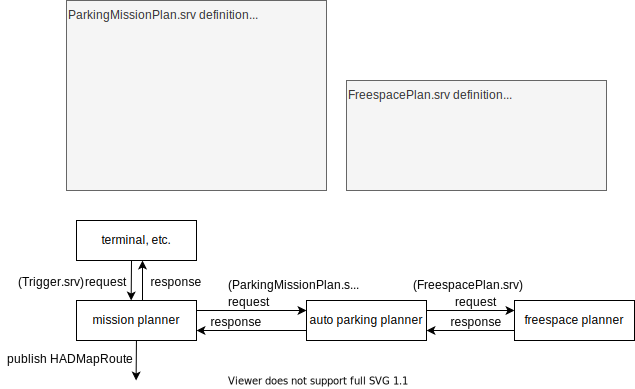
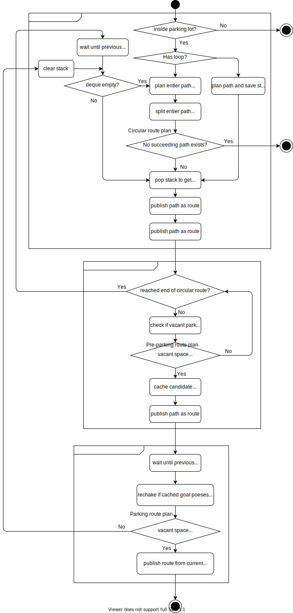

# Auto parking planner

# ROS node diagram
ノードダイアグラムと自動駐車のために定義したサービスの定義を以下に示す.




# Flow chart

 

# How it works
自動駐車では駐車場内を巡回し, 駐車可能なスペースを発見し, 駐車します. これら3つのフェーズに関するプランナをそれぞれCicular route planner, Preparking route planner, Parking route plannerと呼んでいます. それぞれのplannerは`HADMApRoute`を計算し, `autoware_parking_srvs/srv/ParkingMissionPlan.srv`で定義されたサービスを介して, mission planner にrouteを渡し, 最終的にmission plannerがrouteをpublishします. 尚, mission plannerを介さず, auto parking plannerだけで`HADMapRoute`をpublishすることも可能であり, そちらの方が実装は簡単になるのですが, `HADMapRoute`をpublishするのはmission plannerだけであってほしいため, mission plannerを介しています. 

注意点としては, Circular, preparking, parkingは"プランニングに関する"フェーズであり, 車両の走行フェーズではないということです. 例えば以下のフローチャートの`Parking route plan`内の`wait until previous route finished`のノードは一つ前のフェーズの`Preparking route plan`で計画されたルートの走行が完了するまで待つ処理をしています. つまり, parking route plan内で車両のpreparkingに対応する走行フェーズが完了待ちがなされていることになります.

次に各フェーズの詳細を述べます.

## Circular route planning
Circular planningは駐車場内のレーンにループがある場合とない場合で挙動が異なります. 
- ループが無い場合は簡単で, 左下図にあるように, 現在地から駐車場の出口までのルートを計画し, queue(1要素しかない)として保存します. 
- ループがある場合(右下図)にあるように, まず全てのループするレーンを少なくとも一度通るような経路を計画します(A -> C). 次にこの経路をループが生じないように分割します (A -> B, B -> C). そして分割した経路をqueueとして保存します. このqueueの先頭要素をポップしてルート作成します. フローチャートにもあるように, PrparkingやParkingフェーズからCircularフェーズに戻ってくる場合がありますが, この場合queueの先頭要素をポップしてルート作成します. もしqueueが空の場合, 上記のようなループが生じないように分割された経路系列を再計画します. なお, ループがある場合に分割せずにA -> Cのルートを作成するのが自然に思えますが, 現行のRouteHandlerがループがあるルートを処理できないという制約があるため上記のような処理を行っています. 


## Preparking route planning
 走行中, 車から lookahead distance だけ離れた場所を(以下lookahead point) 中心とする探索円内にあるすべての駐車候補地ポーズに関して, 駐車可能かどうかを計算する. lookahead pointは`~/input/trajectory`を用いたスプライン補完により計算しています. `input/trajectory`としては例えば`/planning/scenario_planning/trajectory`が適当です.

駐車可能判定はrosparamで`check_only_goal`が`true`の場合はゴール地点がコストマップのコストとオーバーラップがないことを判定基準とします. `check_only_goal`が`false`の場合, lookahead pointから駐車候補ポーズまでの実行可能経路が計算可能か否かを判定基準とします. このような駐車候補ポーズの駐車可否判定はプログラム中では`askFeasibleGoalIndex`として実装されており, 内部ではFreespacePlannerへのサービスコールにより実現されています. 

`askFeasibleGoalIndex`により駐車可能だと判定された駐車候補ポーズは全て, `std::vector<Pose> feasible_parking_goal_poses`のメンバ変数に保存されます. 駐車可能な候補ポーズが1つでもあれば, 下図 P1(現在位置)からP2(lookahead point)までのルートを作成し, mission plannerに渡してpublishしてもらいます. これにより新しいゴールが設定されるので自動車は一時停止し, engageをセットすることで自動車はlookahead pointに向けて動きはじめます.

駐車可能なポーズが見つかるまでwhile文内で`askFeasibleGoalIndex`は呼ばれ, 見つからないまま, Circular route planningでpublishしたルートの終端地点まで到達してしまった場合, 再びCircular route planningに遷移します. 


## Parking planning
P2(Lookahead point)までの移動が完了するのを待つ. (wait until previous route finished). 実際にはP2に正確に停車することはできない. 実際に停車した位置をP2'とします. 次にすべての`feasible_parking_goal_poses`について再度`askFeasibleGoalIndex`を行い, 駐車可能な駐車ポーズ(P3)が一つでもあれば, P2'からP3までのルートを作成し, mission plannerに渡しpublishしてもらいます(上図右). もしここで駐車可能な駐車ポーズが一つも無い場合, 再びCircular route planningに遷移します. 

# Running on simulation
1. installation
planning_launchについてはautoware_launchの以下のブランチにcheckoutしてビルドする. 
https://github.com/HiroIshida/autoware_launch/tree/feature/autoparking
autoware universeについては, 以下のブランチにcheckoutしてビルドする. 
https://github.com/HiroIshida/autoware.universe/tree/feature/autoparking

2. running (no loop case)
- autowareのtutorialに書かれている標準的な方法で, planning simulatorを起動する.
- parking lot内のレーンにEgo Vehicleをセットする.
- 以下のサービスコールを行い, auto parking を開始する.
```
ros2 service call /planning/mission_planning/service/autopark std_srvs/srv/Trigger
```
- 各プランニングフェーズが終了し, routeがpublishされるごとにengageが要求されるのでbrowserインターフェースを用いるか, 以下のコマンドを端末に打ち込みengageする. 

```
ros2 topic pub --once /autoware/engage autoware_auto_vehicle_msgs/msg/Engage "engage: true"
```

3. running (loop case)
tutorialのplanning simulatorの駐車場のルートはループが無い. ループがある環境でテストするためには, osmマップを以下からダウンロードし使用する.
https://drive.google.com/file/d/1O87YxNXF8apw6qwTZvWGNBx7PiI6AhFv/view?usp=sharing
このマップは松本さんが作られたtier4のoffice2階のロージー向けのosmマップを, レクサスでも使えるように修正(拡大等)したものである.

# Implementation detail
## circular route plannint

isStraightのところ.
overwrapしているところ.
