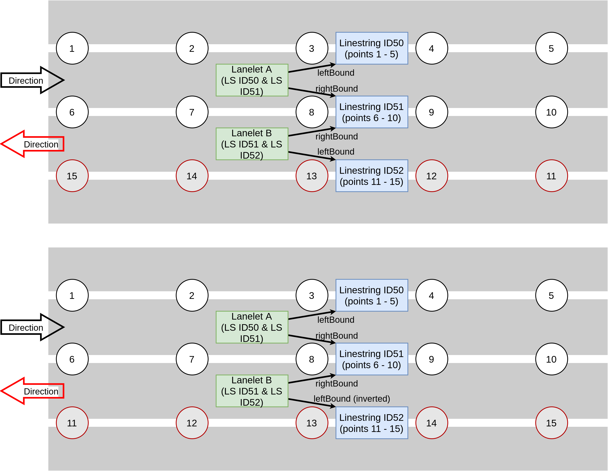
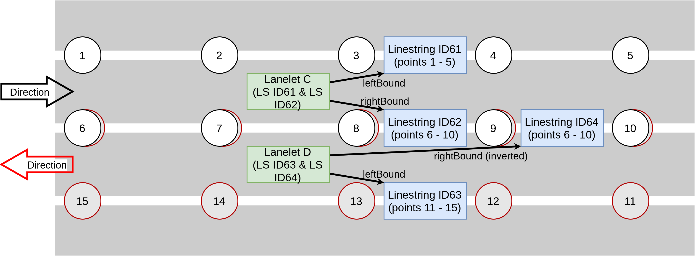
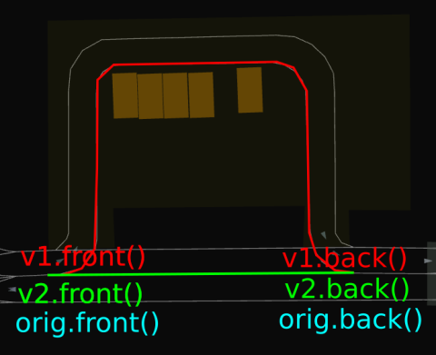
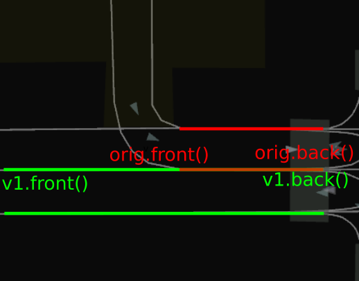
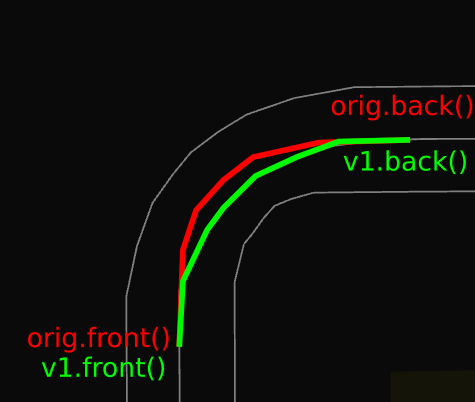

# Design limitation

The document describes the limitations that are currently present in the `behavior_path_planner` module.

The following items (but not limited to) fall in the scope of limitation:

- limitations due to the third-party API design and requirement
- limitations due to any shortcoming out of the developer's control.

## Limitation: Multiple connected opposite lanes require Linestring with shared ID

To fully utilize the `Lanelet2`'s [API](https://github.com/fzi-forschungszentrum-informatik/Lanelet2/blob/master/lanelet2_core/doc/LaneletPrimitives.md#lanelet), the design of the vector map (`.osm`) needs to follow all the criteria described in `Lanelet2` documentation. Specifically, in the case of 2 or more lanes, the Linestrings that divide the current lane with the opposite/adjacent lane need to have a matching `Linestring ID`. Assume the following **ideal case**.



In the image, `Linestring ID51` is shared by `Lanelet A` and `Lanelet B`. Hence we can directly use the available `left`, `adjacentLeft`, `right`, `adjacentRight` and `findUsages` method within `Lanelet2`'s API to directly query the direction and opposite lane availability.

```cpp
const auto right_lane = routing_graph_ptr_->right(lanelet);
const auto adjacent_right_lane = routing_graph_ptr_->adjacentRight(lanelet);
const auto opposite_right_lane = lanelet_map_ptr_->laneletLayer.findUsages(lanelet.rightBound().invert());
```

The following images show the situation where **these API does not work directly**. This means that we cannot use them straight away, and several assumptions and logical instruction are needed to make these APIs work.



In this example (multiple linestring issues), `Lanelet C` contains `Linestring ID61` and `ID62`, while `Lanelet D` contains `Linestring ID63` and `ID 64`. Although the `Linestring ID62` and `ID64` have identical point IDs and seem visually connected, the API will treat these Linestring as though they are separated. When it searches for any `Lanelet` that is connected via `Linestring ID62`, it will return `NULL`, since `ID62` only connects to `Lanelet C` and not other `Lanelet`.

Although, in this case, it is possible to forcefully search the lanelet availability by checking the lanelet that contains the points, using`getLaneletFromPoint` method. But, the implementation requires complex rules for it to work. Take the following images as an example.


Assume `Object X` is in `Lanelet F`. We can forcefully search `Lanelet E` via `Point 7`, and it will work if `Point 7` is utilized by **only 2 lanelet**. However, the complexity increases when we want to start searching for the **direction** of the opposite lane. We can infer the direction of the lanelet by using mathematical operations (dot product of vector `V_ID72` (`Point 6` minus `Point 9`), and `V_ID74` (`Point 7` minus `Point 8`). But, notice that we did not use Point 7 in V_ID72. This is because searching it requires an iteration, adding additional non-beneficial computation.

Suppose the points are used by **more than 2 lanelets**. In that case, we have to find the differences for all lanelet, and the result might be undefined. The reason is that the differences between the coordinates do not reflect the actual **shape** of the lanelet. The following image demonstrates this point.





There are many other available solutions to try. However, further attempt to solve this might cause issues in the future, especially for maintaining or scaling up the software.

In conclusion, the multiple Linestring issues will not be supported. Covering these scenarios might give the user an "everything is possible" impression. This is dangerous since any attempt to create a non-standardized vector map is not compliant with safety regulations.

## Limitation: Avoidance at Corners and Intersections

Currently, the implementation doesn't cover avoidance at corners and intersections. The reason is similar to here. However, this case can still be supported in the future (assuming the vector map is defined correctly).



